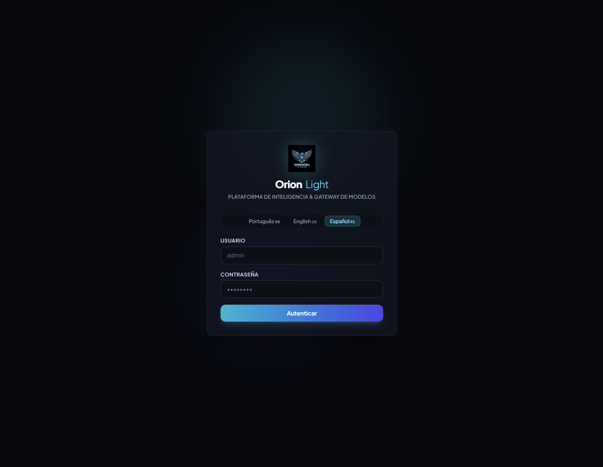
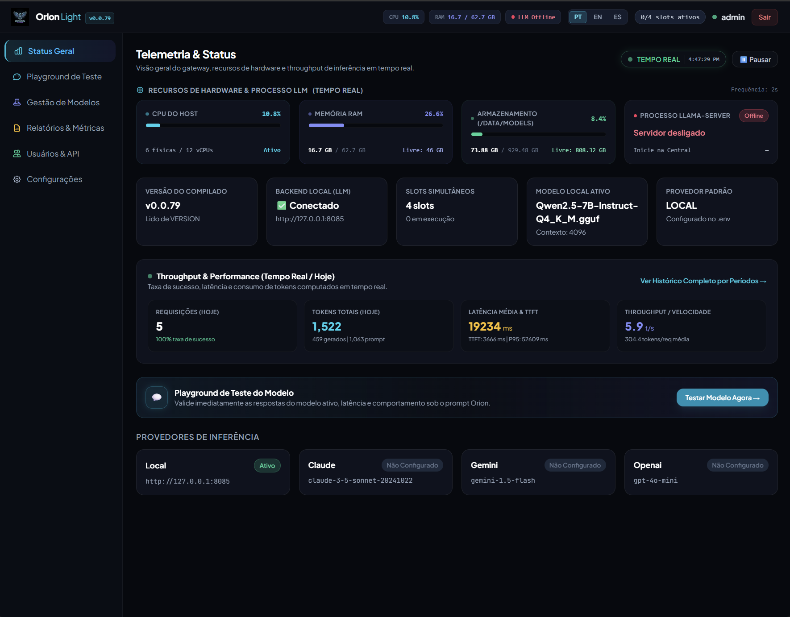
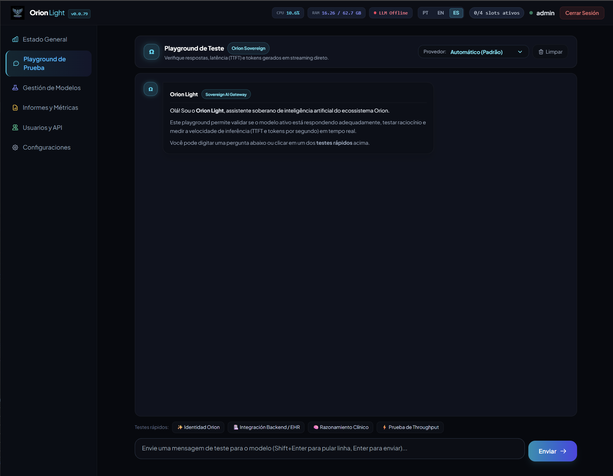
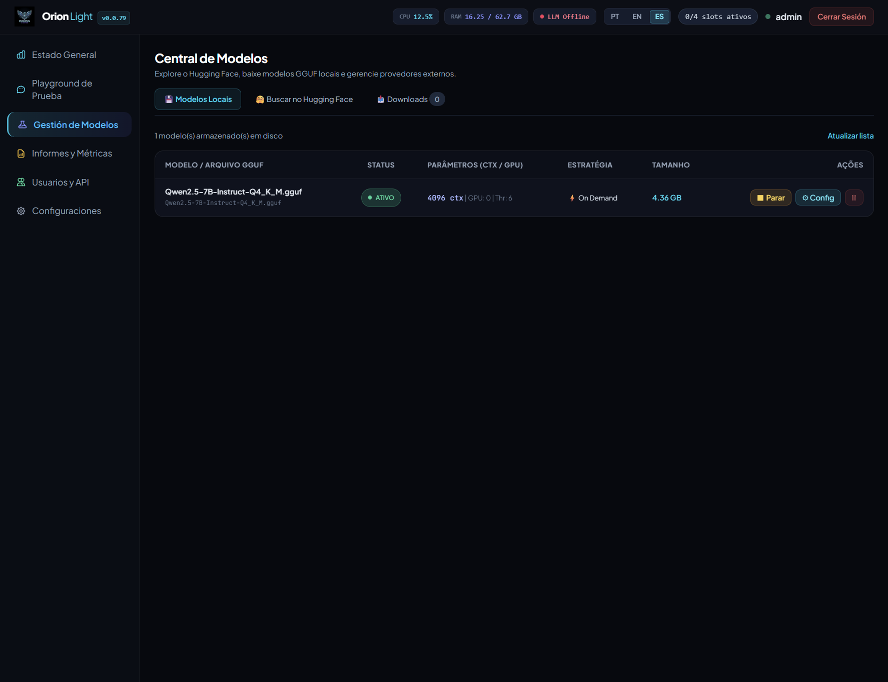
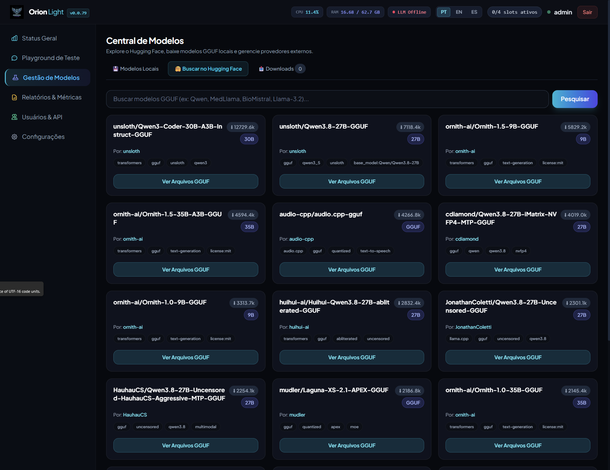
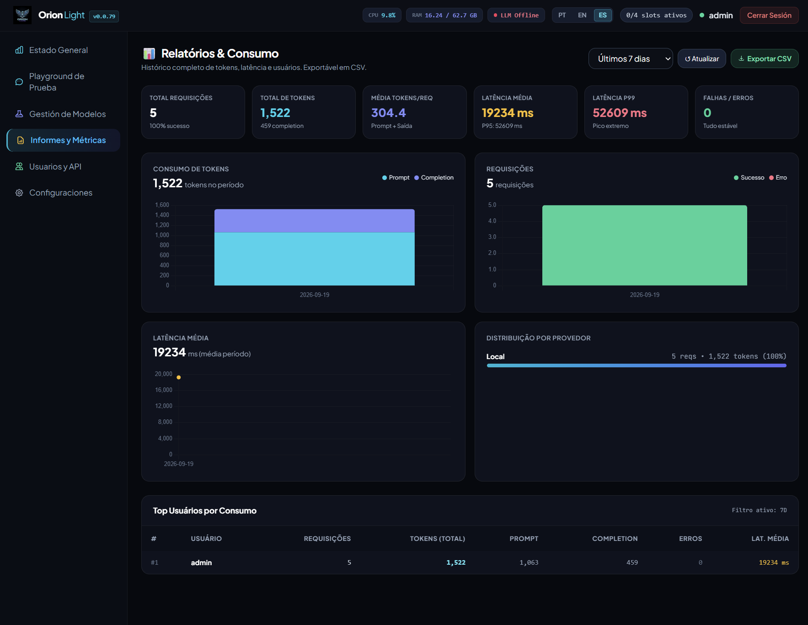
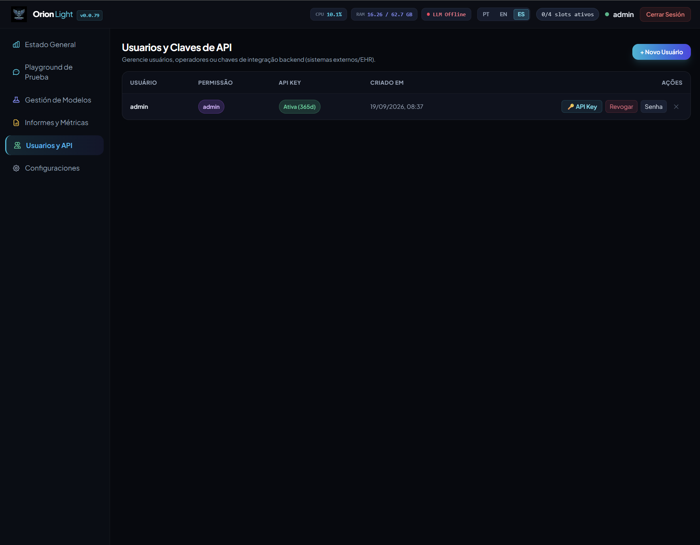
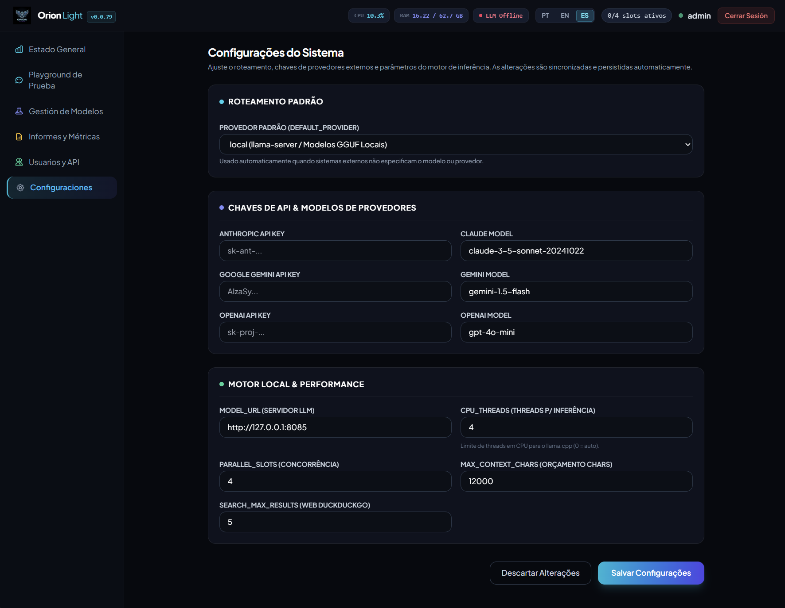

<div align="center">

# Orion Light

### Sovereign AI Gateway & High-Performance Local Inference Platform

[](https://opensource.org/licenses/MIT)
[](https://www.python.org/)
[](https://platform.openai.com/docs/api-reference)
[](https://github.com/ggerganov/llama.cpp)
[](#internationalization-i18n)
[](https://www.docker.com/)

**Orion Light** is an ultra-lightweight, high-performance, asynchronous AI inference middleware and sovereign model gateway. Engineered from the ground up for strict privacy, low resource consumption, and bare-metal CPU/GPU versatility, it combines direct local execution of quantized GGUF models with smart multi-provider fallback, real-time telemetry, and enterprise-grade grounding.

[Key Features](#key-features) •
[Architecture](#system-architecture) •
[Quick Start](#quick-start) •
[Docker Compose](#docker-compose-production) •
[API Reference](#api-compatibility--examples) •
[Hardware Sizing](#hardware-sizing--benchmarks) •
[Configuration](#configuration-reference) •
[License](#license)

---

</div>

## Highlights

- 🔒 **100% Data Sovereignty**: Execute local GGUF models on-premises with zero telemetry sent to third parties. Compliant with HIPAA, LGPD, and GDPR privacy mandates.
- ⚡ **Optimized for CPU & Edge Hardware**: Native multi-threaded inference with thread capping, AVX2/AVX-512 vectorization, and minimal memory overhead.
- 🔄 **OpenAI-Compatible Endpoint**: Drop-in replacement for `/v1/chat/completions` and `/v1/models`. Works seamlessly with LangChain, LlamaIndex, LiteLLM, n8n, Flowise, and the official OpenAI SDKs.
- 🌐 **Hybrid Multi-Cloud Routing**: Transparently fallback to or route specific requests across frontier cloud providers: Anthropic Claude, Google Gemini, and OpenAI.
- 📊 **Real-Time Telemetry & Observability**: Sub-second tracking of host CPU, RAM, process RSS, Time to First Token (TTFT), tokens/second throughput, and active request slots.
- 📥 **Built-in Model Hub & Hugging Face Downloader**: Search, download, and activate quantized GGUF models directly from Hugging Face within the admin dashboard with live ETA and speed tracking.
- 🩺 **Specialized Clinical & Analytical Synthesis**: Native extraction and structuring pipeline for clinical SOAP notes, anamnesis, and evolutions.
- 📚 **Sovereign RAG & Vector Retrieval**: Persistent vector storage via ChromaDB for semantic search over proprietary protocols, PDF documentation, and technical guidelines.
- 🌍 **Native Multilingual Engine (i18n)**: Out-of-the-box multilingual support with live UI language switching for Portuguese (`pt-BR`), English (`en-US`), and Spanish (`es-ES`).

---

---

## Dashboard Showcase

Experience sovereign AI management with a modern, glassmorphic dark-mode web console.

<div align="center">

### 1. Sovereign Authentication & Live Language Switcher
*Zero-dependency JWT authentication with immediate multi-language switching (PT-BR, EN-US, ES-ES).*

<p align="center">
  
</p>

---

### 2. Real-Time Telemetry & Hardware Observability
*Sub-second host CPU, memory, process footprint, slot allocation, and throughput tracking.*

<p align="center">
  
</p>

---

### 3. High-Performance Test Playground
*Interactive prompt testing with live TTFT (Time to First Token), streaming tokens/sec, provider switching, and conversation logs.*

<p align="center">
  
</p>

---

### 4. Integrated Model Hub & Hugging Face Downloader
*Search the entire Hugging Face GGUF catalog, download models in background with live speed/ETA tracking, and swap active models with zero downtime.*

<p align="center">
  
</p>

---

### 5. Execution Parameters & Context Window Allocation
*Fine-grained tuning per model: context window (4K to 64K), CPU thread binding, GPU offloading layers, and warm cache strategy.*

<p align="center">
  
</p>

---

### 6. Historical Telemetry & Consumption Auditing
*Comprehensive audit log of all inference requests, token usage trends, latency distributions, and instant CSV export.*

<p align="center">
  
</p>

---

### 7. Enterprise Access Control & Long-Lived API Keys
*Manage user accounts and generate 365-day Bearer API keys for instant microservice, agent, and backend integration.*

<p align="center">
  
</p>

---

### 8. System Settings & Multi-Provider Cloud Gateway
*Configure hybrid cloud routing with Anthropic Claude, Google Gemini, and OpenAI GPT alongside your local llama-server engine.*

<p align="center">
  
</p>

</div>

---

## System Architecture

```
                    ┌────────────────────────────────────────────────────────┐
                    │                   Client Application                   │
                    │   (Frontend Web / EHR / ERP / Mobile / Microservices)  │
                    └───────────────────────────┬────────────────────────────┘
                                                │ REST / SSE / WebSocket / Bearer Token
                                                ▼
┌────────────────────────────────────────────────────────────────────────────────────────┐
│                                   ORION LIGHT GATEWAY                                  │
│                                                                                        │
│  ┌──────────────────────┐    ┌──────────────────────┐    ┌──────────────────────────┐  │
│  │   Auth & Security    │    │  Inference Router    │    │   Telemetry & Metrics    │  │
│  │  JWT + API Keys      │    │  Local / Cloud Dual  │    │  TTFT / Tokens / Health  │  │
│  └──────────────────────┘    └──────────┬───────────┘    └──────────────────────────┘  │
│                                         │                                              │
│             ┌───────────────────────────┴───────────────────────────┐                  │
│             ▼                                                       ▼                  │
│  ┌──────────────────────────────┐                       ┌──────────────────────────┐   │
│  │   Local llama-server         │                       │ External Cloud Fallback  │   │
│  │   High-Performance Runtime   │                       │ Anthropic Claude         │   │
│  │   - Quantized GGUF Models    │                       │ Google Gemini            │   │
│  │   - CPU Thread Optimization  │                       │ OpenAI GPT               │   │
│  │   - Dynamic Context Windows  │                       │ (Failover / Hybrid)      │   │
│  └──────────┬───────────────────┘                       └──────────────────────────┘   │
│             │                                                                          │
│  ┌──────────┴───────────────────┐    ┌──────────────────────┐    ┌──────────────────┐  │
│  │ Model Hub & Hugging Face     │    │ Persistent RAG       │    │ Web Search Engine│  │
│  │ Background Thread Downloader │    │ ChromaDB Embeddings  │    │ Zero-API Scraping│  │
│  └──────────────────────────────┘    └──────────────────────┘    └──────────────────┘  │
└────────────────────────────────────────────────────────────────────────────────────────┘
```

---

## Key Features

### 1. Dual-Engine Hybrid Routing
Orion Light gives you complete control over where computation takes place. You can deploy completely air-gapped on a private server or configure external API keys to seamlessly fall back to frontier models when high reasoning capacity or extended context is required.

### 2. High-Performance CPU Inference
By pairing an optimized `llama.cpp` server with an asynchronous FastAPI gateway, Orion Light delivers responsive token streaming even on modest multi-core virtual machines (x86_64 and ARM64). Thread limiters ensure the server never starves host processes or causes container OOM panics.

### 3. Strict Sovereign Grounding (Anti-Hallucination)
The built-in prompt supervisor and gateway guardrails enforce strict grounding: if institutional or patient data is requested and not found within the provided prompt or context, the model explicitly declares the absence of records rather than fabricating metrics, patient details, or inventory stats.

### 4. Enterprise Observability & Request Auditing
Every inference request records:
- Input / Output token counts
- Time to First Token (TTFT) in milliseconds
- Total duration and streaming throughput (tokens/second)
- Hardware memory footprint (RSS) and active parallel slots
- Download and export telemetry data to CSV directly from the management console.

---

## Quick Start

### Option A: Run via Docker (Recommended)

Run the all-in-one Orion Light container:

```bash
docker run -d \
  --name orion-light \
  -p 8000:8000 \
  -v orion_data:/data \
  -e SECRET_KEY="generate-a-secure-random-key-here" \
  -e DEFAULT_PROVIDER="local" \
  --restart unless-stopped \
  docker.upgoos.com/orion-light:latest
```

Open your browser at `http://localhost:8000` to access the sovereign dashboard.
- Default credentials: `admin` / `admin` *(prompted to change or manage keys in Users & API)*.

---

### Option B: Local Bare-Metal Setup

#### Prerequisites
- Python 3.11 or higher
- Git & build tools (for optional custom llama-server compilation)

#### 1. Clone the repository
```bash
git clone https://github.com/your-org/orion-light.git
cd orion-light
```

#### 2. Configure Virtual Environment & Dependencies
```bash
python -m venv .venv

# On Linux / macOS:
source .venv/bin/activate

# On Windows (PowerShell):
.venv\Scripts\Activate.ps1

pip install -r requirements.txt
```

#### 3. Setup Environment Variables
```bash
cp .env.example .env
```
Edit `.env` to define your `SECRET_KEY`, model paths, or external API keys.

#### 4. Launch the Server
```bash
uvicorn main:app --host 0.0.0.0 --port 8000 --reload
```

---

## Docker Compose (Production)

For automated production deployments with volume persistence, health checks, and resource limits:

```yaml
version: '3.8'

services:
  orion-light:
    image: docker.upgoos.com/orion-light:latest
    # build: .  # (Uncomment to build from local source)
    container_name: orion-light
    restart: unless-stopped
    ports:
      - "8000:8000"
    environment:
      - SECRET_KEY=replace-with-a-cryptographically-secure-random-key
      - DEFAULT_PROVIDER=local
      - MODEL_URL=http://127.0.0.1:8080
      - PARALLEL_SLOTS=2
      - LLAMA_THREADS=4
      - MAX_CONTEXT_CHARS=16000
    volumes:
      - orion_data:/data
    deploy:
      resources:
        limits:
          memory: 16G
          cpus: '8.0'
        reservations:
          memory: 4G
          cpus: '2.0'
    healthcheck:
      test: ["CMD", "curl", "-f", "http://localhost:8000/health"]
      interval: 30s
      timeout: 5s
      retries: 3
      start_period: 20s

volumes:
  orion_data:
    driver: local
```

Launch with:
```bash
docker compose up -d --build
```

---

## API Compatibility & Examples

Orion Light provides 100% standard OpenAI API compatibility for seamless integration with existing software stacks.

### 1. Standard OpenAI-Compatible Request (cURL)

```bash
curl -X POST http://localhost:8000/v1/chat/completions \
  -H "Content-Type: application/json" \
  -H "Authorization: Bearer <YOUR_API_KEY>" \
  -d '{
    "model": "local",
    "messages": [
      {"role": "system", "content": "You are a professional assistant."},
      {"role": "user", "content": "Explain the advantages of on-premises AI inference."}
    ],
    "temperature": 0.3,
    "max_tokens": 512,
    "stream": true
  }'
```

---

### 2. Python SDK (Official `openai` Package)

```python
from openai import OpenAI

# Point client to your Orion Light gateway
client = OpenAI(
    base_url="http://localhost:8000/v1",
    api_key="your-orion-light-api-key"
)

response = client.chat.completions.create(
    model="local",  # Or "claude", "gemini", "openai"
    messages=[
        {"role": "system", "content": "You are Orion Light, a sovereign assistant."},
        {"role": "user", "content": "Summarize standard clinical SOAP guidelines."}
    ],
    temperature=0.2,
    stream=True
)

for chunk in response:
    content = chunk.choices[0].delta.content or ""
    print(content, end="", flush=True)
```

---

### 3. JavaScript / TypeScript (Streaming Fetch)

```javascript
const response = await fetch('http://localhost:8000/v1/chat/completions', {
  method: 'POST',
  headers: {
    'Content-Type': 'application/json',
    'Authorization': `Bearer ${process.env.ORION_LIGHT_API_KEY}`
  },
  body: JSON.stringify({
    model: 'local',
    messages: [{ role: 'user', content: 'What is the server status?' }],
    stream: true
  })
});

const reader = response.body.getReader();
const decoder = new TextDecoder();

while (true) {
  const { done, value } = await reader.read();
  if (done) break;
  const chunk = decoder.decode(value, { stream: true });
  console.log(chunk);
}
```

---

### 4. Clinical SOAP Synthesis Endpoint

```bash
curl -X POST http://localhost:8000/v1/transcription/synthesize \
  -H "Content-Type: application/json" \
  -H "Authorization: Bearer <YOUR_API_KEY>" \
  -d '{
    "raw_transcription": "Patient reports persistent dry cough for 5 days, mild headache, no fever. Blood pressure 120/80 mmHg. Lungs clear to auscultation. Prescribed hydration and symptomatic relief.",
    "template": "soap"
  }'
```

Supported templates: `soap`, `anamnese`, `evolution`, `custom`.

---

## Hardware Sizing & Benchmarks

The table below provides production hardware sizing recommendations for running quantized GGUF models on modern x86_64 / ARM64 CPUs:

| Model Scale | Quantization | Min. RAM | Recommended RAM | Min. vCPUs | Ideal Use Cases |
| :--- | :--- | :--- | :--- | :--- | :--- |
| **Qwen 2.5 3B** | `Q4_K_M` | 4 GB | 8 GB | 2 – 4 Cores | High throughput, quick classifications, edge appliances |
| **Llama 3.2 3B** | `Q4_K_M` | 4 GB | 8 GB | 2 – 4 Cores | Low latency conversational agents, micro-instances |
| **Qwen 2.5 7B** | `Q4_K_M` | 8 GB | 12 GB | 4 – 8 Cores | General intelligence, document extraction, clinical summarization |
| **Llama 3.1 8B** | `Q4_K_M` | 8 GB | 16 GB | 6 – 8 Cores | Complex reasoning, multilingual conversational tasks |
| **Mistral 7B** | `Q4_K_M` | 8 GB | 12 GB | 4 – 8 Cores | Fast coding, instructions, and standard workflows |
| **Qwen 2.5 14B** | `Q4_K_M` | 16 GB | 24 GB | 8 – 16 Cores | Advanced clinical, legal, and multi-step analytical reasoning |

> 💡 **Tip**: For optimal CPU throughput, configure `LLAMA_THREADS` equal to the number of physical performance CPU cores rather than logical hyperthreads.

---

## Configuration Reference

All settings can be configured via environment variables or the `.env` file:

| Variable | Default | Description |
| :--- | :--- | :--- |
| `SECRET_KEY` | *(Required)* | Cryptographic salt used for signing session tokens and API keys |
| `DATABASE_URL` | `sqlite:////data/orion_light.db` | Database connection URI (SQLite default) |
| `DEFAULT_PROVIDER` | `local` | Default model provider: `local`, `claude`, `gemini`, `openai` |
| `MODEL_URL` | `http://127.0.0.1:8080` | Endpoint of the underlying `llama-server` process |
| `MODELS_DIR` | `/data/models` | Filesystem directory storing downloaded GGUF models |
| `PARALLEL_SLOTS` | `2` | Number of simultaneous inference requests allowed in parallel |
| `LLAMA_THREADS` | `4` | CPU worker threads allocated to the local inference engine |
| `MAX_CONTEXT_CHARS` | `16000` | Sliding window token budget to avoid context boundary truncation |
| `RAG_DIR` | `/data/chroma_db` | Persistent storage directory for ChromaDB vector embeddings |
| `ANTHROPIC_API_KEY` | `""` | Optional API key for Anthropic Claude fallback |
| `CLAUDE_MODEL` | `claude-3-5-sonnet-20241022` | Anthropic model identifier |
| `GEMINI_API_KEY` | `""` | Optional API key for Google Gemini fallback |
| `GEMINI_MODEL` | `gemini-1.5-flash` | Google Gemini model identifier |
| `OPENAI_API_KEY` | `""` | Optional API key for OpenAI GPT fallback |
| `OPENAI_MODEL` | `gpt-4o-mini` | OpenAI model identifier |

---

## Internationalization (i18n)

Orion Light features built-in, zero-dependency multilingual capabilities for global deployment:

- **Supported Languages**:
  - 🇧🇷 **Português** (`pt`)
  - 🇺🇸 **English** (`en`)
  - 🇪🇸 **Español** (`es`)
- **Instant Toggle**: Switch languages on-the-fly from the login screen or the top application bar without page reloading.
- **Persistent Preferences**: Selected language is saved locally in browser storage.
- **Prompt Synchronization**: System prompts and guardrails dynamically adapt to the active user language.

To contribute a new translation, add your language code and key-value mapping to `static/i18n.js`.

---

## Security & Sovereignty

- **Zero Phoning Home**: Orion Light initiates outbound connections strictly when the operator triggers Hugging Face downloads, Web Search, or cloud provider inference.
- **Local Isolation**: SQLite database, model binaries, and vector stores remain fully encapsulated in the specified data volume.
- **Granular Access Control**: Revoke API keys instantly via the admin panel with real-time invalidation.
- **Constant-Time Password Verification**: Bcrypt password hashing ensures resilience against brute-force attacks.

---

## Contributing

We welcome contributions from developers worldwide! To contribute:

1. Fork the repository.
2. Create a dedicated feature branch:
   ```bash
   git checkout -b feat/my-awesome-feature
   ```
3. Commit your changes with clear, structured messages:
   ```bash
   git commit -m "feat: add support for dynamic quantization profiling"
   ```
4. Push to your branch and open a Pull Request.

Please ensure code compiles without warnings and passes all linting tests.

---

## License

Orion Light is released under the permissive [MIT License](LICENSE).  
You are free to use, modify, distribute, and commercialize this software in personal, enterprise, and cloud environments.

---

<div align="center">
  <sub>Developed by the <b>Orion AI Contributors</b>. Built for sovereign, secure, and accessible AI worldwide.</sub>
</div>
